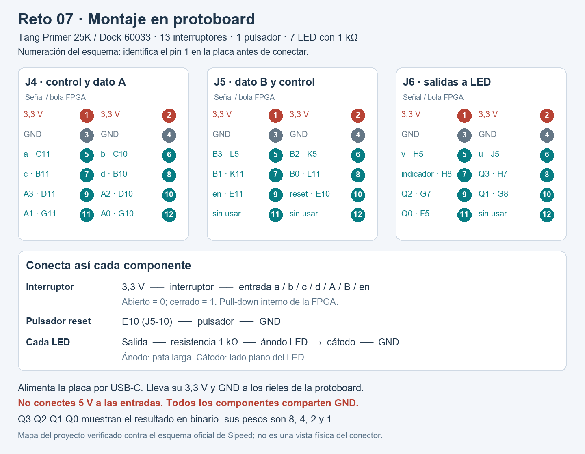

# Montaje del Reto 07 con Sipeed LED×8

Materiales: Tang Primer 25K con Dock 60033, módulo Sipeed LED×8, protoboard, dos DIP de ocho interruptores, un pulsador, 29 jumpers macho–macho. Si el riel negativo está dividido, agregar un jumper para unir sus mitades.

Conectar el LED×8 directamente al PMOD **J6**, con la placa apagada. Alinear los 12 contactos y las marcas de alimentación del módulo y del Dock; identificar el pin 1 antes de insertarlo. El módulo ya contiene las resistencias de los LED y se alimenta desde la placa a 3,3 V.

Las entradas salen de los conectores **hembra J4 y J5**. Una punta macho del jumper entra en el agujero del pin indicado en la placa; la otra entra en la protoboard. Conectar **GND de J4, pin 3**, al riel negativo con otro jumper macho–macho. GND del pin 4 de J4, o de los pines 3/4 de J5, es equivalente. No hace falta conectar los pines de 3,3 V para las entradas.

Cada interruptor conecta una entrada a GND al cerrarse. El pull-up interno mantiene el pin en alto cuando está abierto; el adaptador Verilog invierte ese nivel. Por tanto, **abierto = 0 lógico y cerrado = 1 lógico**. No se necesitan resistencias externas en las entradas ni alimentar el riel positivo.

## Interruptores y jumpers

Este ejemplo usa una protoboard con columnas A–E y F–J, separadas por la ranura central. A–E de una misma fila están unidos; F–J de esa fila forman otro grupo independiente.

Colocar el primer DIP atravesando la ranura central, con contactos opuestos en E10–E17 y F10–F17. Los jumpers macho–macho llevan las señales del conector hembra J4 a A10–A17. Desde J10–J17, conectar jumpers macho–macho al riel de GND.

Colocar el segundo DIP atravesando la ranura en las filas 25–32. Usar cinco posiciones: señales en A25–A29, y jumpers macho–macho desde J25–J29 a GND. Las otras tres posiciones quedan libres. Identificar cada interruptor por su fila; la numeración impresa del DIP depende de su orientación.

| Entrada | Pin hembra del Dock | Nombre del pin FPGA | Señal en protoboard | Puente a GND |
|---|---|---|---|---|
| a | J4-5 | **C11** | A10 | J10 → GND |
| b | J4-6 | **C10** | A11 | J11 → GND |
| c | J4-7 | **B11** | A12 | J12 → GND |
| d | J4-8 | **B10** | A13 | J13 → GND |
| A[3] | J4-9 | **D11** | A14 | J14 → GND |
| A[2] | J4-10 | **D10** | A15 | J15 → GND |
| A[1] | J4-11 | **G11** | A16 | J16 → GND |
| A[0] | J4-12 | **G10** | A17 | J17 → GND |
| B[3] | J5-5 | **L5** | A25 | J25 → GND |
| B[2] | J5-6 | **K5** | A26 | J26 → GND |
| B[1] | J5-7 | **K11** | A27 | J27 → GND |
| B[0] | J5-8 | **L11** | A28 | J28 → GND |
| en | J5-9 | **E11** | A29 | J29 → GND |
| Reset | J5-10 | **E10** | Grupo del primer contacto del pulsador | Segundo contacto → GND |
| GND | J4-3 | GND | Riel negativo | Unir las mitades si están separadas |

Identificar el pin 1 de cada conector antes de contar: cada PMOD tiene dos filas de seis contactos, con 1,3,5,7,9,11 en una fila y 2,4,6,8,10,12 en la otra. El dibujo muestra la numeración del esquema. Usar los nombres de pin C11, B11, D11, etc., indicados en la placa cuando estén impresos.

## Pulsador

Colocar el pulsador atravesando la ranura central, en una zona libre. Una punta macho entra en E10 (conector hembra J5, pin 10); la otra comparte el grupo de agujeros con un contacto del pulsador. El otro contacto se conecta a GND con un jumper macho–macho. En un pulsador de cuatro patas, escoger dos contactos que se unan solamente al presionar; verificar esta pareja con continuidad antes de alimentar.

Al presionar se borran Q y flag_q. Los indicadores u/v y en siguen mostrando sus entradas actuales.

## LED del módulo

El LED×8 es activo en bajo. El adaptador invierte sus salidas para que **LED encendido = 1 lógico**.

L1–L8 indican el orden previsto según la relación de pines proporcionada para el montaje. La posición visual debe contrastarse en la placa siguiendo `prueba_placa_inicial.md`. La columna D identifica el componente en el esquema oficial del módulo; las dos numeraciones son distintas.

| Orden de lectura | LED del esquema | Señal | Pin de J6 | Bola FPGA |
|---|---|---|---|---|
| L1 | D5 | Q[3], peso 8 | 6 | J5 |
| L2 | D6 | Q[2], peso 4 | 5 | H5 |
| L3 | D8 | Q[1], peso 2 | 7 | H8 |
| L4 | D7 | Q[0], peso 1 | 8 | H7 |
| L5 | D3 | flag_q | 9 | G7 |
| L6 | D4 | u | 10 | G8 |
| L7 | D1 | v | 11 | F5 |
| L8 | D2 | en_led | 12 | G5 |

Leer los ocho LED como **Q3 Q2 Q1 Q0 flag u v en**. L1–L4 representan el resultado binario, con pesos 8,4,2,1. L5 muestra préstamo, acarreo, paridad o empate según la operación. L6=u, L7=v y L8=en. El Dock usa H8 en el contacto de L3, según el esquema oficial; H6 no se utiliza en este conector.

## Comprobación

Alimentar la placa por USB-C. Abrir en, ajustar el control y los datos, esperar 0,1 segundos y cerrar en. Abrir en de nuevo para conservar el resultado. Mientras en siga cerrado, el registro se actualiza con el reloj.

| Operación | a b c d | A | B | Q esperado | Indicador |
|---|---|---|---|---|---|
| RESTA | 0 0 0 0 | 0101 (5) | 0011 (3) | 0010 (2) | 0 |
| SUMA | 0 0 1 0 | 0101 (5) | 0011 (3) | 1000 (8) | 0 |
| XOR | 0 0 0 1 | 0101 (5) | 0011 (3) | 0110 (6) | 0 |
| MAYOR | 0 0 1 1 | 0101 (5) | 0011 (3) | 0101 (5) | 0 |
| SUMA con acarreo | 0 0 1 0 | 1111 (15) | 0001 (1) | 0000 (0) | 1 |
| RESTA con préstamo | 0 0 0 0 | 0000 (0) | 0001 (1) | 1111 (15) | 1 |
| MAYOR con empate | 0 0 1 1 | 0111 (7) | 0111 (7) | 0111 (7) | 1 |

Estos valores son resultados esperados para comprobar el montaje; no son mediciones de la placa.

Prueba inicial: a b c d = 1000, A = 1000, B = 1000 y en = 1. Cerrar solo C11, D11, L5 y E11; dejar las otras entradas abiertas. La operación es RESTA, 8 − 8 = 0. Los LED L1–L8 deben mostrar **00000001**. Al abrir únicamente E11, deben mostrar **00000000**.

Proyecto: `fpga/gowin/reto07_20230113/reto07_20230113.gprj`. Top: `tang_top_20230113`. Dispositivo: GW5A-LV25MG121NC1/I0, revisión A. Reloj: 50 MHz en E2, restricción de 20 ns. Bitstream: `fpga/bitstream/reto07_20230113.fs`.

Fuentes: [esquema oficial del Dock 60033](https://dl.sipeed.com/fileList/TANG/Primer_25K/02_Schematic/Tang_Primer_25K_Dock_60033_Schematic.pdf), [esquema del núcleo 52300](https://dl.sipeed.com/fileList/TANG/Primer_25K/02_Schematic/Tang_Primer_25K_52300_Schematic.pdf), [esquema Sipeed PMOD 8×LED](https://dl.sipeed.com/fileList/TANG/PMOD/PMOD_8XLED_Schematic.pdf) y [documentación Sipeed PMOD](https://wiki.sipeed.com/hardware/en/tang/tang-PMOD/FPGA_PMOD.html).
