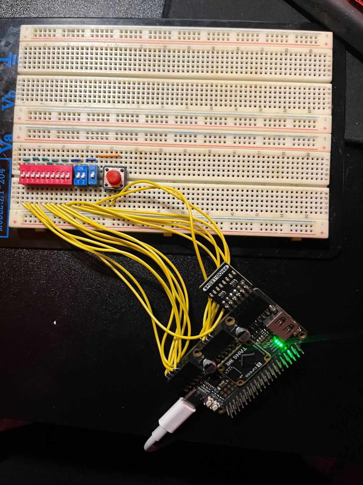
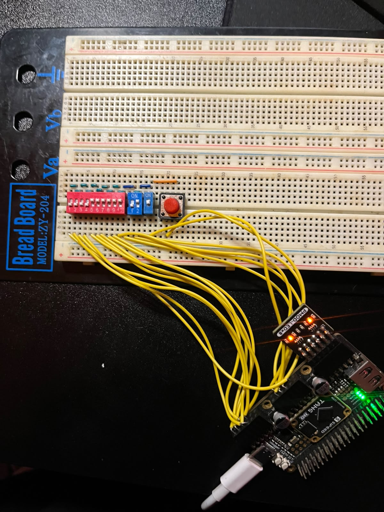
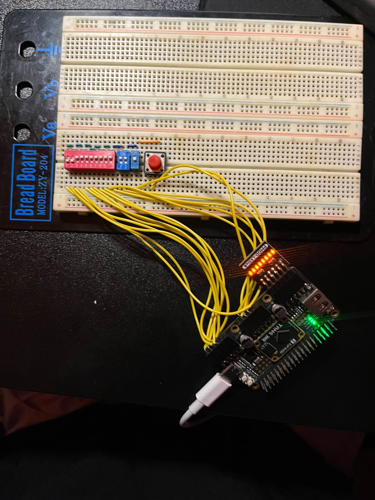
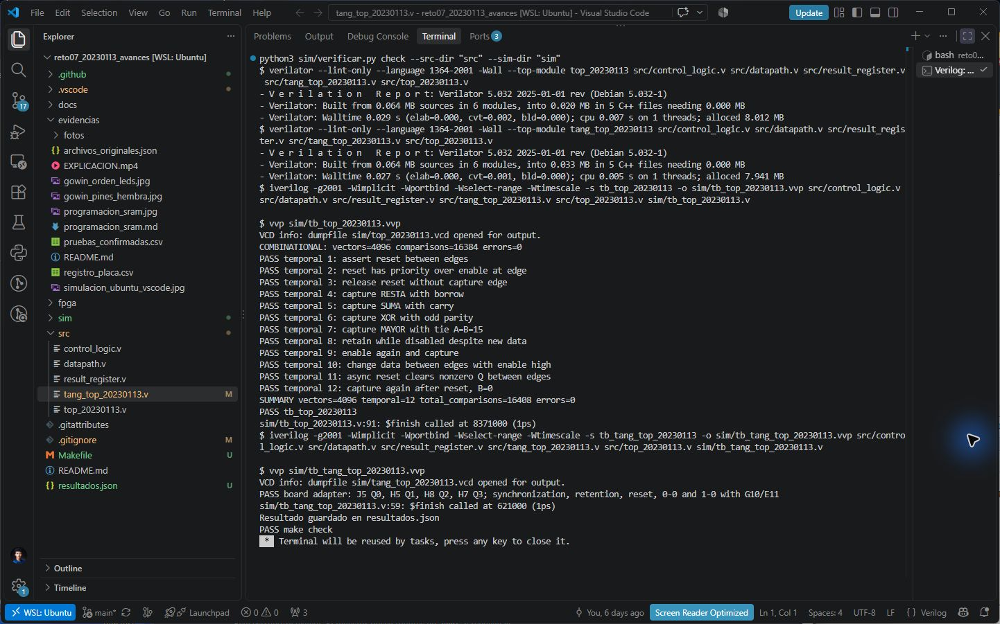

# Evidencias del funcionamiento

Riky Ramos · Matrícula 20230113 · Reto 07

Montaje en protoboard con interruptores, pulsador de reset, Tang Primer 25K y Sipeed LED×8. Las fotografías y el video se conservan con el contenido original.

## Explicación en video

[Ver o descargar EXPLICACION.mp4](https://raw.githubusercontent.com/Rikyry/reto07-20230113/main/evidencias/EXPLICACION.mp4)

[Archivo del video en el repositorio](EXPLICACION.mp4)

## Fotografías

### Montaje general

### Salidas activas

### Panel encendido

## Informe y registros

[Informe del proyecto con fotografías](../docs/informe_20230113_reto07.pdf)

[Pruebas confirmadas del montaje](pruebas_confirmadas.csv)

[Registro de programación SRAM](programacion_sram.md)

Las lecturas de la demostración se interpretan como `v | en | flag | u | Q3 Q2 Q1 Q0`. El archivo `archivos_originales.json` registra los nombres originales, tamaños y SHA-256 de las fotos y del video.

La tarea `Verilog: check` se ejecuto en VS Code con Ubuntu. El lint paso sin advertencias y ambos testbenches terminaron correctamente. [Resumen de resultados](../resultados.json).

